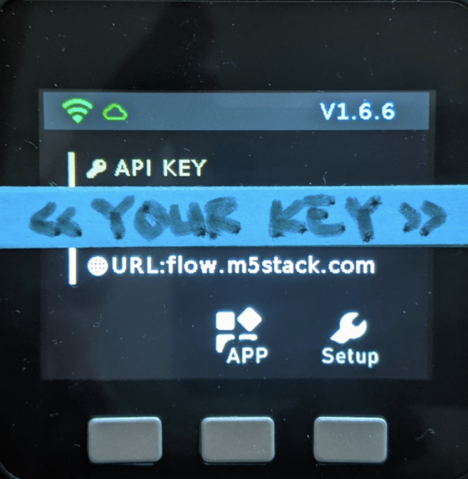

# m5stack-co2-monitor

Disclaimer: This project is inspired by [https://github.com/aquahika/M5Stack-MHZ19-Co2Display](https://github.com/aquahika/M5Stack-MHZ19-Co2Display)

This tiny tutorial describes how you can build a CO2 measuring device that can help to reduce the spread of Covid-19. 

You can read more about the correlation between CO2-concentration and the potential risk of Covid-19 infection in this paper: [Risk assessment of aerosols loaded with virus based on CO2-concentration.](https://depositonce.tu-berlin.de/bitstream/11303/11478.3/9/hartmann_kriegel_2020_en_v3.pdf)

The following hardware and software will be used in this tutorial:

<table>
  <tr>
   <td>Hardware</td>
   <td>Software</td>
  </tr>
  <tr>
  <td><a href="https://eckstein-shop.de/M5Stack-ESP32-Basic-Core-IoT-Development-Kit">M5Stack ESP32 Basic Core IoT Development Kit</a></td>
  <td><a href="https://flow.m5stack.com/">UIFlow Web IDE</a> (MicroPython)</td>
  </tr>
  <tr>
   <td><a href="https://www.amazon.de/-/en/gp/product/B07VD15YRP/ref=ppx_yo_dt_b_asin_image_o01_s00?ie=UTF8&psc=1">ICQUANZX MH-Z19 Infrared CO2 Sensor Module</a></td>
   <td><a href="https://m5stack.oss-cn-shenzhen.aliyuncs.com/resource/software/M5Burner_MacOS.zip">M5Stack Burner</a></td>
  </tr>
</table>


## 00 Getting started

### 1. Download and install M5Stack Burner
You can find the official instructions [here](https://m5stack.github.io/UIFlow_doc/en/en/base/Update.html)

On Mac:
*   Download the <a href="https://m5stack.oss-cn-shenzhen.aliyuncs.com/resource/software/M5Burner_MacOS.zip">M5Stack Burner</a> & Unzip
*   Move “electron-m5burner-v2-eletron” file to your application folder (:warning: important)
*   Open the application (and allow Mac to open applications from an unknown source)
    *   Go to System Preferences > Security and Privacy > General
    *   Unlock so you can make changes
    *   Allow application to open
*   Create an account for UIFlow and login with the M5 Burner (:warning: important)


### 2. Flash UIFlow to your M5Stack
* Connect you M5Stack Core device to your computer using USB
* Download the UIFlow for the M5Stack Core device

* Enter your wifi credentials and hit the burn button
* After successful installation of the UIFlow software, you device should display your API Key



## 01 Hello World
It's time for your first lines of code running on your device!
* Go to <a href="https://flow.m5stack.com/">flow.m5stack.com</a>
* Select UIFlow Beta

* Select Core and enter your API Key

* Select the Python tab and start writing your first hello world (:wave: :earth_africa:)
```print('hello wolrd!')```
* Select the USB interface for your device and open the ```COM Monitor```

* If everything is correct, it should look similar to  this

## 02 Connect the CO2 Sensor
TODO

## 03 CO2 Monitor
TODO